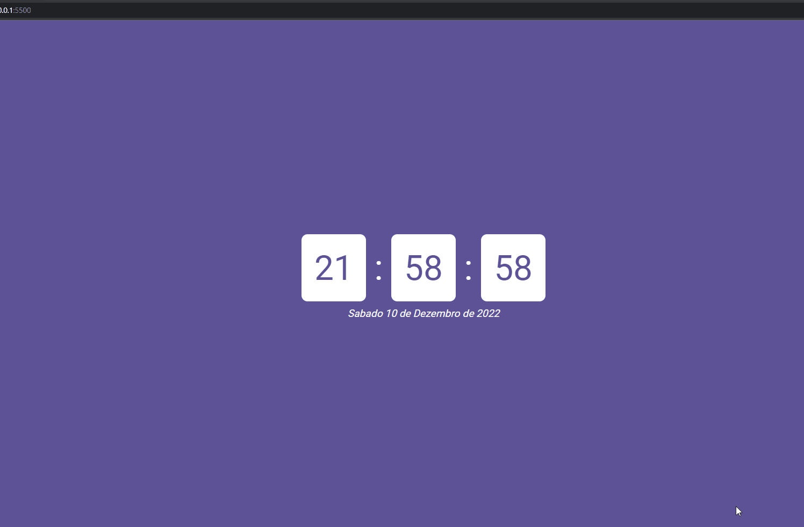

# Projeto Relógio digital com data ⏰📅

Página que apresenta um relógio digital e a data. Codificado sem uso de bibliotecas de manipulação de data e hora.

Algumas funcionalidades: mostra a hora, mostra a data.

## Tecnologias

- Javascript
- CSS
- HTML

---

<h2 align="center">Viewport</h2>

 
___
